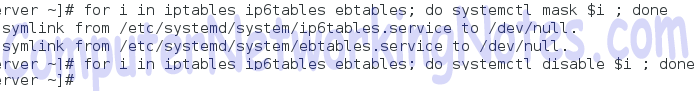

# Firewalld Basic concepts Explained with Examples

This tutorial explains basic concepts of firewalld zones, services, port and rich rules) and firewalld terminology (Trusted, home, internal, work, public, external, Dmz, block and drop) in detail with examples. Learn how to enable firewalld service, disable iptables service, what firewalld is and how it works in Linux step by step.

Firewalld is the new concept and default tool to manage the host based Firewall in Centos/RHEL7.0. In earlier version, iptables was used to manage the firewall. The iptables service still exist, but it should not be used to manage the firewall.

**Firewalld** has several advantages over iptables. Such as iptables uses three separate services for IPv4 (iptables), IPv6 (ip6tables) and software bridging (ebtables). While **firewalld** uses single service for all three settings. Firewalld uses DBus messing system which allows us add remove rules / ports from running firewall. With this feature, we don’t have to restart the firewall each time when we make changes. Such a facility was not available in iptables. Unless you have any specific reason to use iptables, always use firewalld service to manage the firewall.

To learn about iptables service in detail with example, see this tutorial. [How to configure iptables in linux]()

For demonstration purpose I will use following RHCE LAB which is specially setup for the practice of RHCE exam objectives.


We will configure firewalld service on Server system and test it from remaining systems.

This tutorial is the first part of our article **"How to configure Firewall in Linux Step by Step"**. You can read other parts of this tutorial here.

    How to Configure Firewalld in Linux

    This is the second part of article. This part explains how to configure firewall in Linux step by step with examples including firewall-cmd command and its options for zones, services and ports management.

    Firewalld Rich Rules Explained with Examples

    This is the last part of article. This part explains Firewalld Rich Rules in detail with examples including how rich rules are used to configure the firewall in Linux.


## Disabling iptables service

Firewalld is incompatible with iptables and should never be used with it. Running both services simultaneously will mess-up the firewall. Whatever service you choose, disable and mask the other.

There are three iptables services:-

* iptables for IPv4 configuration
* ip6tables for IPv6 configuration
* ebtables for software bridge

We can disable these services individually with following commands

```
systemctl disable iptables
systemctl disable ip6tables
systemctl disable ebtables
```

Or we can use for loop to disable all services with single command

```
for i in iptables ip6tables ebtables; do systemctl disable $i; done
```

In multi-user environment, other user may enable iptables service again accidentally or intentionally. To stop iptables service completely we can mask it. A masked service cannot be started manually or automatically.

To mask all iptables services we can use following commands

```
systemctl mask iptables
systemctl mask ip6tables
systemctl mask ebtables
```

Or just like previous option we can use for loop.

```
for i in iptables ip6tables ebtables; do systemctl mask $i; done
```

In multi-user environment, other user may enable iptables service again accidentally or intentionally. To stop iptables service completely we can mask it. A masked service cannot be started manually or automatically.

To mask all iptables services we can use following commands

```
systemctl mask iptables
systemctl mask ip6tables
systemctl mask ebtables
```

Or just like previous option we can use for loop.

```
for i in iptables ip6tables ebtables; do systemctl mask $i; done
```

Following figure illustrates the use of for loop to disable and mask the iptables services



## Enabling firewalld Service

f you have just disabled the active iptables service and trying to enable the firewalld service then firewalld service may not be start. Switching from iptables to firewalld requires a system restart. First disable and mask active iptables services and restart the system. Then enable and start the firewalld service.

To check the current status of firewalld service we can use following command.
```
#systemctl status firewalld
```
If firewalld service is masked, it will never start. We have to unmasked the firewalld service before we can start it. To unmask the firewalld service we can use following command:-
```
#systemctl unmask firewalld
```
Once unmasked, we can start it with following command:-
```
#systemctl start firewalld
```
With start option service will start only for this session. To start it permanently we have to use enable option.
```
#systemctl enable firewalld
```
Following figure illustrates above process step by step


Before we start working with firewalld, make sure firewalld service is active and running.

## Zone

For easier management firewalld categorizes the incoming traffic in Zone based on interface and source address. Zones are created to handle the similar traffic separately. Let’s understand it with an example.

Suppose we have a server which has two LAN cards. First LAN card is connected with public network (such as internet) and second LAN card is connected with private network. Server has following security requirements :-

* Open HTTP port (80) and block all remaining ports for public network.
* Open FTP port (21) and block all remaining ports for private network.
To understand how zone concept makes management easier, let’s create firewall rules for above requirements

### Without Zone concept

* If packet is coming for port 80 then check from where it is coming. If it is coming from public network, allow it. If it is coming from private network, deny it.
* If packet is coming for port 21 then check from where it is coming. If it is coming from public network, deny it. If it is coming from private network, allow it.
* If packet is coming for other port except 80 or 21 then deny it.


With Zone concept
Zone concept allows us to divide incoming traffic based on NICs. Since first NIC is connected with public network and second NIC is connected with private network, we can create two separate zones; public zone for first NIC and private zone for second NIC. Assign first NIC in public zone and second NIC in private zone.

#### Rules in public zone
If packet is coming for port 80, allow it. If packet is not coming for port 80, deny it.

#### Rules in private zone
If packet is coming for port 21, allow it. If packet is not coming for port 21, deny it.


As we can see managing firewall with zone is much easier than without zone.

Firewalld includes following pre-defined zones based on the level of trust we have on incoming traffic.


Key points
* When a packet arrives in system, firewalld checks its source address to find out whether that address belongs to any specific zone. If yes then packet will be filtered by that specific zone. This allows us to define and activate multiple zones even if there is only one NIC is available in system.
* If packet does not belongs to any specific zone based on source address then firewalld tries to find out the zone based on the interface from which packet entered in system. If NIC on which packet arrived belong to any specific zone, packet will be filtered by that specific zone.
* If source address and NIC on which packet arrived do not belong to any specific zone, packet will be filtered by the default zone.
* Default zone is set to public zone. We can set any other zone or custom zone as default.
* Each zone has its own rules for services and ports which are opened or closed.
* As per requirement, we can create new zone or update existing zones.
* System pre-defined zone files are stored in /usr/lib/firewalld/zones while any custom zones files are stored in /etc/firewalld/zone location.


Zone files are formatted in easy and self-explanatory XML format. For example have a look on default public zone file


As you can see, it contains straightforward information; zone name, zone description and allowed services.

### Services
Services are the secondary key element in firewalld concept. Using services in zone files is the best way to manage the firewall rules. Services are used to create pre-defined rules for related network services in zone files. Following table explains some common services used in default zone files.


To get a list of all available services we can use following command


Besides system default services, we can also create custom services. System default services are located in /usr/lib/firewalld/services/ and custom services are stored in /etc/firewalld/services/. Custom services always overruled the pre-defined services.


Just like zones, services also have their own configuration files that explains which ports (TCP/UDP) are filtered and if required, which kernel modules must be loaded. Service configuration files are also simple and straightforward. For example have a look on default ssh service file.


As we can in output it contains service name, service description, protocol type and port number.

    * A service in firewalld is only for used for data filtration. Do not take it for actual network service. Actual network services are managed through the systemd.

### Port

Firewalld allows us to manage the network port directly. Even if a particular service is not installed in system, we can open or close its associated port in firewall. For example port 22 which is associated with SSH service can be opened or closed even if SSH service is not installed in system.

### Direct interface with Rich Rules
Firewalld allows us to pass security rules directly to the iptables using direct interface mode. But these rules will remain only in current session. Once firewalld service is restarted or configuration is reloaded, all new rules applied in current session will be vanished. To overcome this issue firewalld supports rich language. Rules created from rich language can persistent permanently. Rich language has several other advantage over direct interface mode such as we can create rules for specific time, after that rules will be automatically removed.

That’s all for this introductory part. In next part we will learn how to configuration firewalld service step by step in detail with examples.