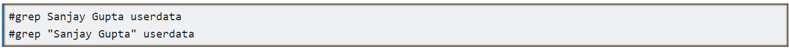

# Grep Command in Linux Explained with Practical Examples

This tutorial explains how to use grep command in Linux with practical examples such as performing case insensitive search, printing lines numbers and displaying number of lines before and after every match in grep output.

The grep command allows us to extract any information from any file. As Linux stores settings and configurations in text files, knowing how to use the grep command not only helps in exams but also boosts confidence on job.

        This tutorial is the second part of the article "grep command in Linux explained with options and regular expressions". Other parts of this article are following.

        grep options, regex, parameters and regular expressions

        This tutorial is the first part of the article. It explains grep command options and regular expressions with the special meanings of Meta characters.

        grep regex practical examples of regular expressions

        This tutorial is the third part of the article. It explains how to use regular expressions with grep command in detail with practical examples.

        use extended regular expressions with grep command

        This tutorial is the fourth part of the article. It explains how to use extended regular expressions with grep command in detail with practical examples.


For demonstration purpose, I will use the practice lab which I created in the first part of this article.

### How to search a sentence or a search pattern that contains white space

To search a sentence or multiple words which contain white space, we have to enclose them with quotes. If we do not enclose the white space then grep searches only the first word from the specified sentence. Remaining words are treated as files where grep searches for the specified pattern. To see it practically, let's search a user name Sanjay Gupta in file userdata without quote and with quote.



Following figure shows both commands with output.


As we can see in above output, when we did not enclose the string Sanjay Gupta with quotes, only the word Sanjay was searched and the word Gupta was taken as file path. But when we enclosed the string Sanjay Gupta with quotes, it was considered as a search string.

### How to perform a case insensitive search with grep

By default, grep matches case. It means, for grep the word sanjay and the word Sanjay are two different words. If you search the word sanjay, it will not display the lines which contain the word Sanjay. Vice versa if you search the word Sanjay, it will not display the lines which contain the word sanjay. To see it in action, let's search both words in our practice file userdata.

```
#grep Sanjay userdata
#grep sanjay userdata
```

To perform a case insensitive search with grep command, use –i option. The –i option instructs grep command to ignore the case while matching the pattern. Let's perform one more search for the same word sanjay, but this time use –i option with grep command.

```
#grep -i sanjay userdata
```
Following figure illustrates above commands with output.


As we can see in above output, without –i option, grep matched exact word but with this option it ignored the case.

### How to print line numbers in grep command output

By default, grep does not print line numbers in output. But if require, you can ask it to print the line numbers along with lines. To print number of lines, use -n option. For example, following command search a keyword Host in file /etc/ssh/ssh_config and print the output with line numbers.

```
#grep –n Host /etc/ssh/ssh_config
```


### How to search all files and directories recursively with grep command
The grep command supports recursive search. It can search in all files and directories recursively. To perform a recursive search, use -r option with grep command.

If this option is used, grep first searches all files of the specified directory. If specified directory contains another directory, it also searches that directory and all of its subdirectories as well.

In our lab, we created a multilevel directory structure. We also created a file named custom_file in the last directory of this structure. This file contains some dummy text string. Let's find that string from the root directory.
```
#grep -r xxx123 rhcelab
```
In above command, xxx123 is the search pattern and rhcelab is the main or parent directory.


If you want to search only in few files, instead of searching in all file recursively you can search only in desired files. The grep allows us to specify multiple files name as arguments. For example, to search the text string "test" in file1, file2, file3 and file4, you can use following command.
```
#grep test file1 file2 file3 file4
```

### How to print file names which contains the specified pattern with grep command

If you don't know which file contains the specified pattern, you can perform a file name search with grep command. For example, suppose you don't know which files in /etc/ directory contain IP configuration or IP related settings. In this case, you can ask grep to search all files in /etc/ directory for keyword "IP address" and print their names at command prompt with following command.
```
#grep –r –l "ip address" /etc/
```


The -l option asks grep to print the name of file which contains the specified pattern instead of the lines of that file which contain the pattern.

### How to show number of lines before every match
The grep allows us to print the number of lines before every match. To show the number of lines before every match, use –B option. For example, following command shows 2 lines before every match.

```
#grep –B 2 "DocumentRoot" /etc/httpd/conf/httpd.conf
```


### How to print next lines after every match
Just like the previous lines, you can also print next lines after every match. To print the next lines after every match, use –A option with grep command. For example, following command print next 2 lines after every match.
```
#grep –A 2 "DocumentRoot" /etc/httpd/conf/httpd.conf
```


### How to show line before and after every match
Since grep allows us to specify multiple options, we can combine both –A and –B options to print the number of lines before and after every match. For example, following command prints 1 line before and after every match.
```
#grep –B 1 –A 1 "DocumentRoot" /etc/httpd/conf/httpd.conf
```


That's all for this part. In next part of this tutorial, I will explain how to use regular expressions with grep command in detail. If you like this tutorial, please share it with friends through your favorite social platform.