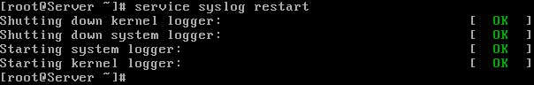

# How to Configure Syslog Server in Linux

This tutorial explains how to configure Syslog Server in Linux step by step with example. Syslog server provides a centralized platform to manage, access and monitor logs from local system as well as from remote systems (if configured). Learn how to configure Syslog server to accept logs from system and remote system.

**Sample Exam question:-** You are a System administrator. Using Log files very easy to monitor the system. Now there are 40 servers running as Mail, Web, Proxy, DNS services etc. Your task is to centralize the logs from all servers into on LOG Server. How will you configure the LOG Server to accept logs from remote host ?

### Answer with Explanation

An important part of maintaining a secure system is keeping track of the activities that take place on the system. If you know what usually happens, such as understanding when users log into your system, you can use log files to spot unusual activity. You can configure what syslogd records through the **/etc/syslog.conf** configuration file.

The syslogd daemon manages all the logs on your system and coordinates with any of the logging operations of other systems on your network. Configuration information for syslogd is held in the **/etc/syslog.conf** file, which contains the names and locations for your system log files.

By Default system accept the logs only generated from local host. In this example we will configure a log server and will accept logs from client side.

For this example we are using two systems one linux server one linux clients .

* A linux server with ip address 192.168.0.254 and hostname Server
* A linux client with ip address 192.168.0.1 and hostname Client1
* Updated /etc/hosts file on both linux system
* Running portmap and xinetd services
* Firewall should be off on server

We suggest you to review that article before start configuration of log server. Once you have completed the necessary steps follow this guide.

Check **syslog, portmap, xinetd** service in system service it should be on
```
#setup Select  System service from list [*]portmap [*]xinetd [*]syslog 
```
Now restart **xinetd** and **portmap** service


To keep on these services after reboot on then via chkconfig command


After reboot verify their status. It must be in running condition


Now open the **/etc/sysconfig/syslog** file


and locate **SYSLOGD_OPTIONS** tag


add -r option in this tag to accepts logs from clients


```
-m 0 disables 'MARK' messages.
-r enables logging from remote machines
-x disables DNS lookups on messages recieved with -r
```
After saving file restart service with service syslog restart command



### On Linux client

ping from log server and open /etc/syslog.conf file


Now go to the end of file and do entry for serve as user.* @ [ server IP] as shown in image


After saving file restart service with service syslog restart command

Now restart the client so it can send log entry to server. ( Note that these logs will generate when client boot, so do it restart not shutdown)


### Check clients log on Log server
To check the message of client on server open

In the end of this file you can check the log from clients

