# How to Configure and use Linux as a Router

On an IP network, two computers can communicate only if they belong to the same IP subnet. If two computers belong to different IP subnets, they need a router to connect. A router is a special device that not only provides IP forwarding as the main function but also supports many other IP-based features such as; packet filtering, voice over IP, IP firewall, etc.

A router is an expensive device. Configuring it is also a complex task. If you have a Linux system and need only IP forwarding, you can use it. Linux provides a zero-cost solution for IP forwarding.

### LAB setup

We need a Linux system to configure the IP forwarding. We need two more systems for testing. We will configure these systems in different IP subnets. We will use the Linux system to provide connectivity between both IP subnets.

The following image shows this setup.

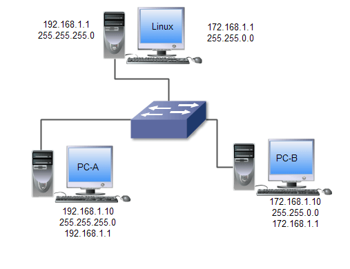

On the Linux system, we need to configure two IP addresses. If you have two interfaces, you can configure one IP address on each. If you have only one interface, you can configure both IP addresses on it. Linux allows you to configure and use multiple IP addresses on the same interface.

To configure both IP addresses on the same interface, use the following steps.

* Start the nmtui utility
* Select Edit a connection on the main screen
* Select the interface on the left pane and use the Edit option to open its configuration
* Select the Manual method on the IPv4 configuration section
* Assign two IP addresses 192.168.1.1/24 and 172.168.1.1/18. To assign the second IP address, use the Add button.
* Save the configuration and quit the nmtui utility
The following image shows the above process.

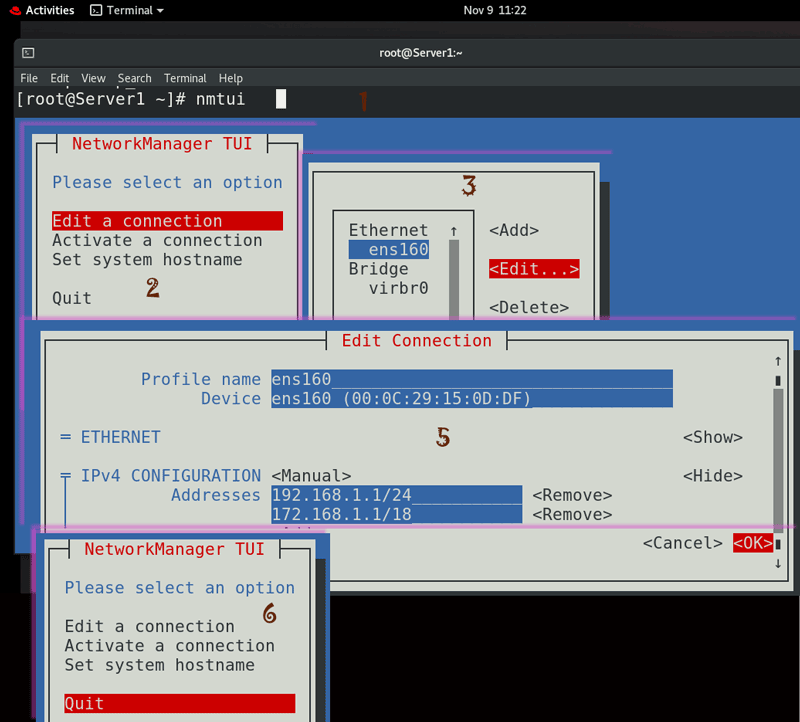

To learn more about the above process, you can check the following tutorial.

How to configure multiple IP addresses on Linux

To check and verify the new IP configuration, you can use the 'ip addr show [interface]' command.

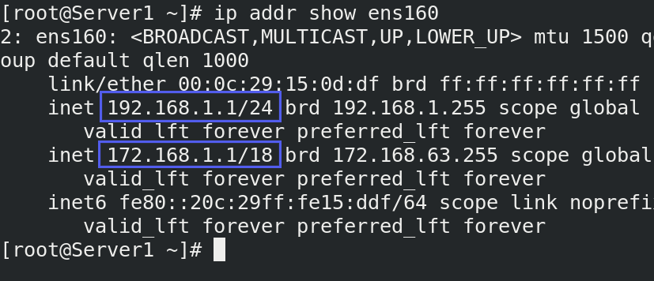

Use the same process, and configure IP addresses on both systems that you want to use for testing. On these systems, you also need to add the gateway IP address. Add the Gateway IP address from the same subnet.

On PC-A, assign an IP address (192.168.1.10/24) from the network 192.168.1.0/24 and configure the gateway to 192.168.1.1.

On PC-B, assign an IP address (172.168.1.10/18) from the network 172.168.1.0/18 and configure the gateway to 172.168.1.1.

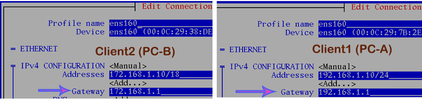

After adding the IP configuration on both systems, verify the IP address and Gateway IP address.

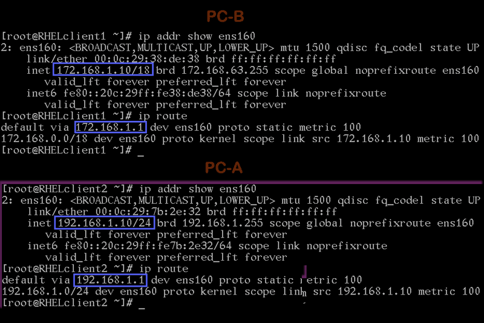

### Testing the LAB setup

To test this lab setup, perform the following steps.

Send ping requests from PCA (192.168.1.10) to gateway IP (192.168.1.1/24) configured on the Linux system. You should get replies from the gateway IP. After it, send ping requests to PCB (172.168.1.10/18). Since we have not configured the IP forwarding on the Linux system, you should not get replies from PCB. You can also use the tracepath command to view the path packets take to reach PCB.

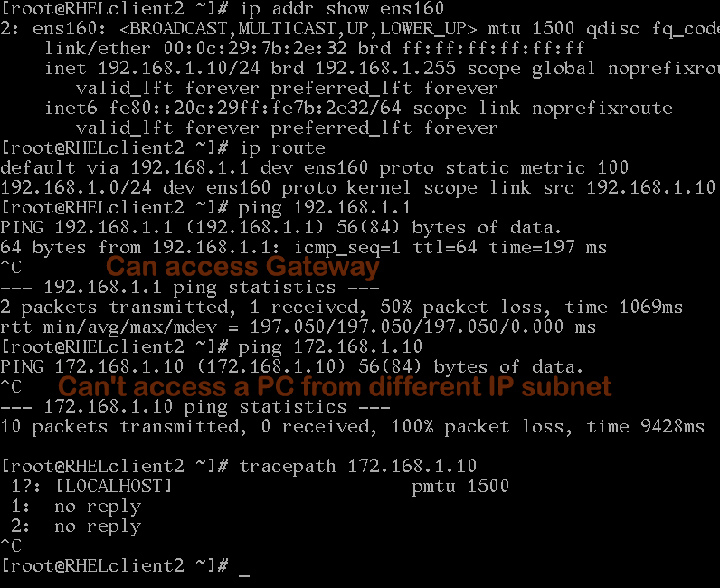

Perform the same testing from PCB.

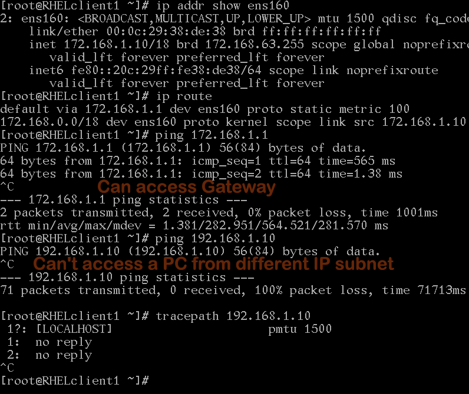

### Enabling the IP forwarding

To configure Linux as a router, we need to enable IP forwarding. To enable and disable IP forwarding, Linux uses two configuration values 0 and 1. It uses the value 0 to disable and the value 1 to enable IP forwarding.

You can enable or disable IP forwarding in two ways temporary and permanent.

### Temporary enabling/disabling the IP forwarding

Linux keeps all running processes in the /proc directory. The /proc directory represents the current state of the kernel. It allows applications and users to view currently running processes and update their settings on the live system.

Linux controls the IP forwarding through the /proc/sys/net/ipv4/ip_forward process. There are two ways to change the value of this process. You can use the echo command to directly update this value. Or if you don't want to directly update this value, you can use the sysctl command to change this value.

Let's understand both methods.

#### Using the echo command

The following command displays the current state of the IP forwarding.

```
cat /proc/sys/net/ipv4/ip_forward
```

The following command enables the IP forwarding in the current session.

```
echo 1  > /proc/sys/net/ipv4/ip_forward 
```

The following command disables the IP forwarding in the current session.
```
echo 1 > /proc/sys/net/ipv4/ip_forward
```
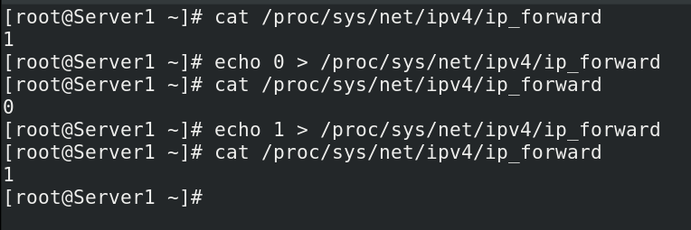

### Using the sysctl command

The following command enables IP forwarding.
```
#sysctl -w net.ipv4.ip_forward=1
```
The following command disables the IP forwarding.
```
#sysctl -w net.ipv4.ip_forward=0
```

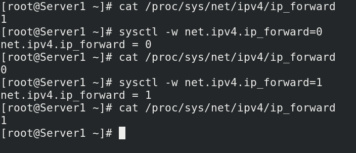

### Permanently enabling/disabling the IP forwarding

Linux uses the /etc/sysctl.conf file to enable or disable the IP forwarding at the boot time.

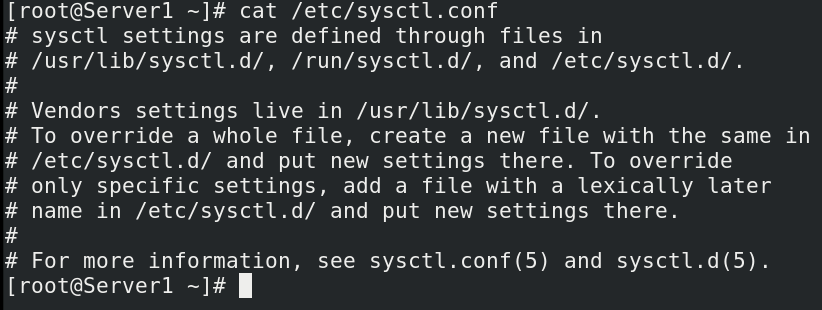

To permanently enable the IP forwarding, add the following lines at end of the file.
```
#Permnanenlty enabling the IP forwarding
net.ipv4.ip_forward = 1
```
To permanently disable the IP forwarding, add the following lines at end of the file.
```
#Permnanenlty disabling the IP forwarding
net.ipv4.ip_forward = 0
```

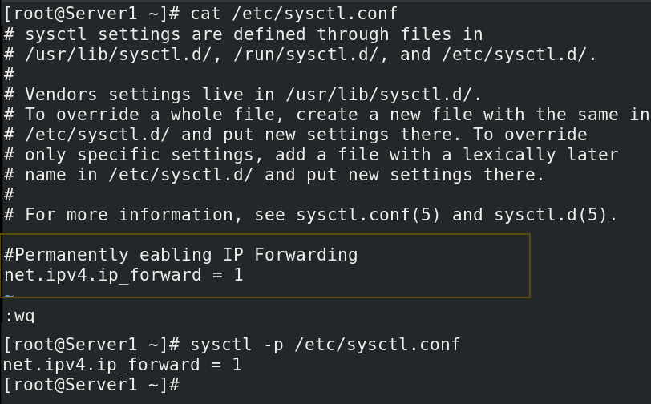

### Testing the IP forwarding

To test the IP forwarding, enable the IP forwarding on the Linux system and send ping requests from PCA to PCB again. This time, PCA should get replies from PCB.

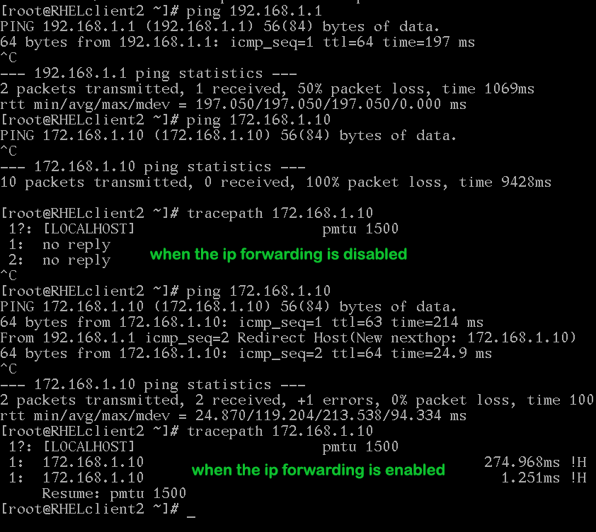

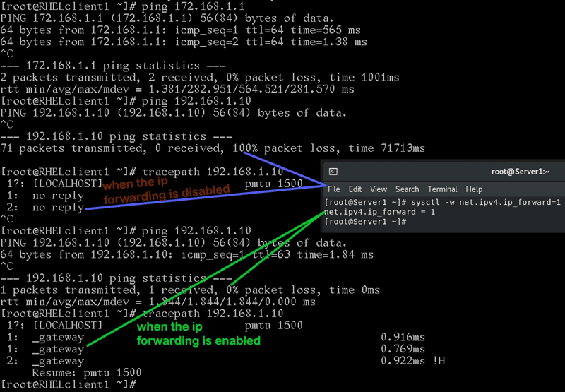

If both PCs can access each other, it verifies that the Linux system is working as the router and the IP forwarding is enabled on it.

That's all for this tutorial. In this tutorial, we learned how to use the Linux system as a router and enable IP forwarding on it.