# How to Configure iptables Firewall in Linux
This tutorial explains how to install, enable and configure iptables service in Linux step by step. Learn iptables rules, chains (PREROUTING, POSTROUTING, OUTPUT, INPUT and FORWARD), tables (Filter, NAT and Mangle) and target actions (ACCEPT, REJECT, DROP and LOG) in detail with practical examples.

To deal with growing security threats firewall must be used. Based on pre-defined rules, firewall can check each passing data packet. A host based firewall is the integrated part of RHEL/Centos Linux.

Linux uses ***netfilter*** kernel module for firewall. The ***netfilter*** module in kernel allows us to filer any incoming, outgoing and forwarded data packet even before it reaches at user level application. To communicate with ***netfilter*** module we have two tools; iptables and firewalld. Although it is possible to use both services at the same time, but that is not recommended. Both services are incompatible with each other’s. Running both services simultaneously will mess-up the firewall.

Next part of this tutorial explains **iptables** service in detail with examples.You can read it here. [Firewalld Basic concepts Explained with Examples]()

In this part we will understand **iptables** service. For demonstration purpose I will use following RHCE LAB which is specially setup for the practice of RHCE exam objectives.

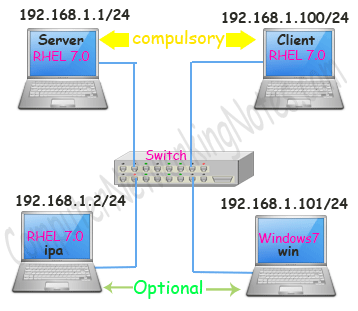

We will configure iptables service on Server system and test it from on remaining systems.

### Disable firewalld service

As we know, iptables and firewalld are incompatible with each other’s. To avoid any unnecessary complication we should always use one service while keeping disable other. To disable the firewalld service we can use following commands
```
systemctl disable firewalld
systemctl mask firewalld
```
First command will disable the service while second command will mask it. A disabled service can be started manually. But a masked service cannot be started manually or automatically.

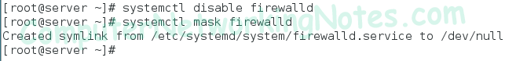

## Install iptables in RedHat Linux 7.0
iptables requires two RPMs; iptables and iptables-services. To find out whether the both packages are installed or not we can use following rpm query command.
```
rpm –qa iptables*
```
If above command does not return any output then both packages are not installed. If output returns only package then other is missing.

If **iptables** package is missing, we will get following error.
```
iptables command not found.
```
If iptables-services package is missing we will get following error while starting the iptables service.
```
Failed to execute operation: Access denied.
```
iptables service will not start until we have both packages. We can install missing RPM from two commands; yum and rpm.

To install packages from yum command use following:-
```
yum install -y iptables
yum install -y iptables-services
```
yum command depends on repository. If system is connected with repository, above commands will install the iptables service with all dependencies . If system is not connected with any repository, above commands will not work.

Alternatively if we have RHEL installation disk (or local copy of Packages directory from RHEL installation disk), we can use rpm command to install the necessary RPMs. Packages directory on RHEL installation media contents all RPMs. To install iptables service from rpm command use following:-
```
rpm –ivh iptables-[version number]
rpm –ivh iptables-services-[version number]
```
To verify the installation we can use rpm query command again.

Following figure illustrates iptables rpm query, installation and verification process.

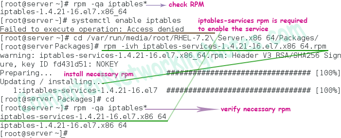

## Enable iptables services
Once we have installed necessary RPM we can manage iptables service through the systemctl management tool.

To start iptables service use following command
```
systemctl start iptables
```
To verify the status use following command
```
systemctl status iptables
```
With start option service will be enabled only for this session. To start it permanently we have to use enable option.
```
systemctl enable iptables
```
Following figure illustrates above process

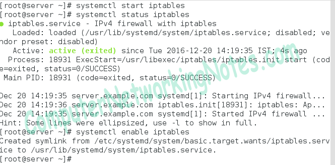

As output indicates iptables service is up and running. Before we learn how to configure it, let’s have a quick look on some essential terminology used by this service.

## Basic concepts of iptables
As we know iptables filters data packets based on pre-defined rules. So basically rules are the instructions which iptables should follow when a match found. Similar rules are grouped in chains. For examples we may group rules in two chains, in first chain we can keep the rules which will filter the incoming traffic while in second chain we can store the rules which will filter the outgoing traffic. There are five pre-defined chains; INPUT,OUTPUT,FORWARD,PREROUTING and POSTROUTING. If iptables is configured, data packet must go through at least one of these chains. Each chain has an action known as target. Target have following values

* ACCEPT :- Allows the packet pass through.
* REJECT :- Discards the packet and sends a notification back.
* DROP :- Discards the packet without sending notification back.
* LOG :- Sends packet information to rsyslogd daemon for logging.
Chain can also inspect the packet based on its state. Following are some common states:-

* NEW :- Packet is not the part of any exiting communication.
* ESTABLISHED :- Packet is the part of an existing communication.
* RELATED:- Packet is the part of other existing communication.
* INVALID :- Packet does not match with any states.
Based on function chains are stored in tables. There are three pre-defined tables ; Filter, NAT and Mangle.

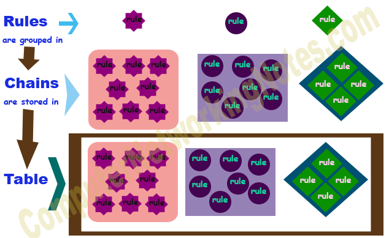

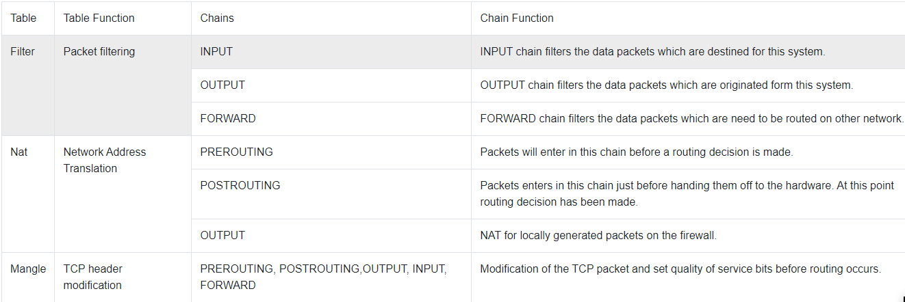

### iptables configuration file
iptables uses ***/etc/sysconfig/iptables*** configuration file to store the rules. Following figure illustrates the default content of this file.

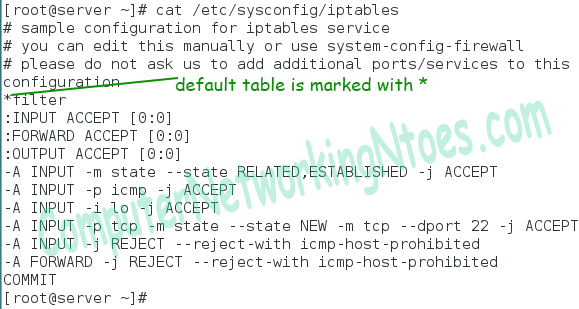

First line shows the default table which is set to filter table. Next three lines show to chains status. Remaining six lines show the default rules one by one. First rule says accept all incoming packets from established connection. Second rule accepts all ICMP requests. Third rule accepts all connections on loopback interface. Fourth rule accepts new SSH connections. Last two rules reject any network packets generated from any source with icmp-host-prohibited.

We have three options to add/update/remove rules in this file:-

* Directly editing in this file via text editor (Not recommended)
* From iptables command (most preferred way to manage the rules)
* From system-config-firewall graphical tool (deprecated and removed from RHEL7.0)
First option is not recommended and third option is deprecated. So theoretically we have only second option to manage the configuration file. Let’s understand it in details.

### iptables command line explained
Basic syntax for iptables command is following:-
```
iptables [options] [chain] -j [target]
```
We have already discussed chain and target, let’s have a look on some common options.

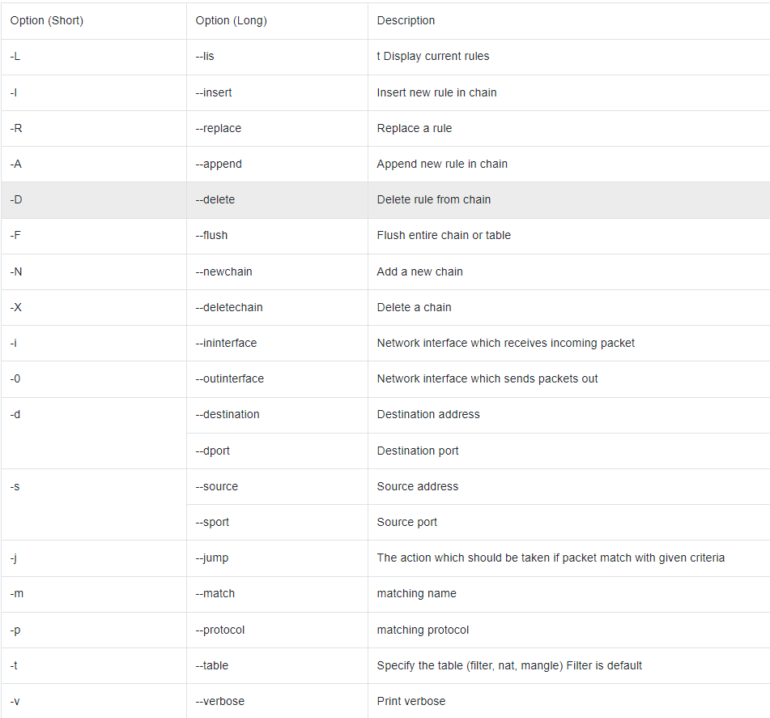

While working with configuration files we should always follow a simple guideline, always takes backup before modify. Following this lifesaver guideline let’s make a copy of current working rules

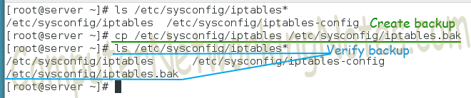

If anything goes wrong, we can restore working iptables configuration from backup copy.

### iptables command examples
Before we add new rules let’s have a look on existing rules

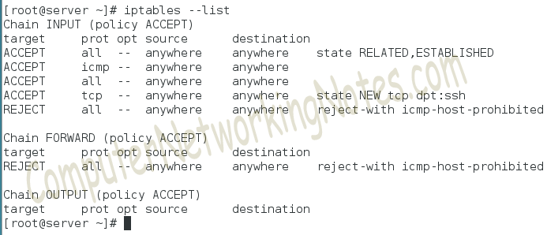

As output indicates there are no custom rules in any chains except the default rules. All chains are set to default policy which is ACCEPT ( for all traffic).

To get a better understanding of rules lets flush the default rules.

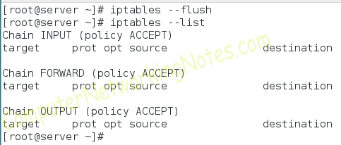

Any change will not be saved until we manually save them with following command
```
#service iptables save
```
To understand it more clearly lets view the iptables file again without running above command

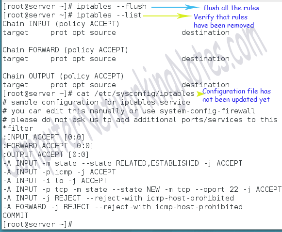

Now save the rules and view the file again

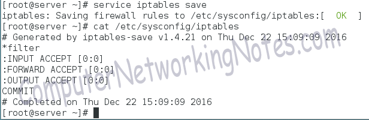

So whenever we make any change, we have to save them with service iptables save command. Besides this we also have to restart the iptables service with following command so new rules can take effect.
```
#systemctl restart iptables
```
### iptables practice
Add the following rules and test the configuration from respective LAB systems.

* Allow Telnet connection only from 192.168.1.101/24 . Drop Telnet connection from remaining hosts without any notifications.
* Allow SSH connection only from 192.168.1.100/24. Reject SSH connections from remaining systems with notification.
* Allow FTP connection only from 192.168.1.2/24. Reject FTP connections from remaining systems with notification.
* Allow HTTP connection from all hosts on port 80.
* Reject ping requests from all hosts with error message.
For the first requirement we have to create two rules. In first rule we have to allow the host 192.168.1.101 then in second rule we have to deny all remaining hosts.
```
iptables –A INPUT –s 192.168.1.101/32 –p tcp --dport 23 -j ACCEPT
iptables –A INPUT –s 192.168.1.0/24 –p tcp --dport 23 -j DROP
```
Let’s break above commands,

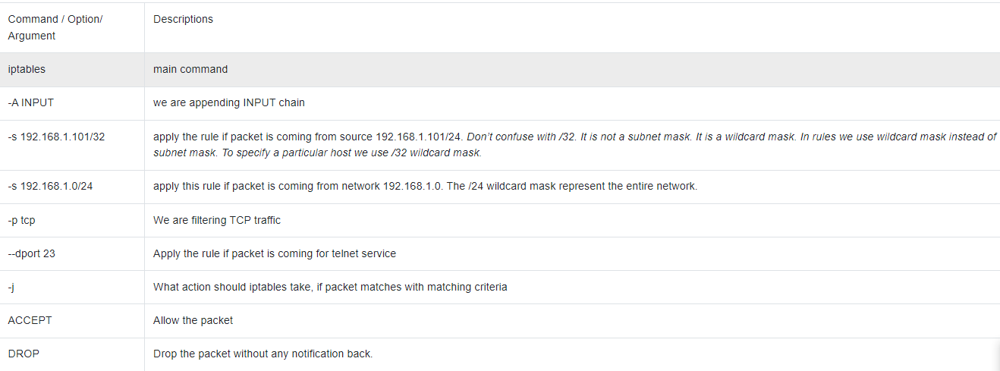

So basically

first commands says “Let the packet pass if it is coming for telnet service from host 192.168.1.101/24”.

Second command says “Drop all the packets without any notification if they are coming for telnet service from network 192.168.1.0/24”.

Have you noticed conflict between rules?

First rule says allow host 192.168.1.101/24 while second rules says deny all hosts from network 192.168.1.0/24. Host 192.168.1.101 also belongs to 192.168.1.0/24 network. So both conditions apply on host 192.168.1.101/24.

In this situation which rule will be applied on packet coming from host 192.168.1.101/24 for telnet service?

To find out the answer we have to understand the basic packet processing flow.

### Firewall packet processing flow
* When a packet arrives, firewall checks all rules.
* Rules are always processed from top to down.
* Every rule has certain matching criteria.
* If packet matches with matching criteria in any rule, action associated with that particular rule will be executed.
* Once a match found, no further processing should be done for that packet. Technically this is also make sense, as once match found, associated action (allow/reject/drop) will be taken for that packet and packet will not be available for further processing.
* Thus order of rules play important role in firewall.
In above condition a packet from host 192.168.1.101/24 will never be matched with second rule.

Second and third requirements also look like as first requirement. In first requirement we filtered telnet service while in second and third requirement we will filter SSH(Port 22) and FTP(Port 21) service respectively.
```
iptables –A INPUT –s 192.168.1.100/32 –p tcp --dport 22 -j ACCEPT
iptables –A INPUT –s 192.168.1.0/24 –p tcp --dport 22 -j DROP
iptables –A INPUT –s 192.168.1.2/32 –p tcp --dport 21 -j ACCEPT
iptables –A INPUT –s 192.168.1.0/24 –p tcp --dport 22 -j DROP
```
The fourth requirement is allowing all hosts on port 80. Since we are allowing all source address, we can omit source address in rule.
```
iptables –A INPUT –p tcp --dport 80 -j ACCEPT
```
The last requirement is blocking all ICMP request.
```
iptables –A INPUT –p icmp -j REJECT
```
As we know firewall rules will not be applied until we save them and restart the service. Next two commands will save the rule and restart the service
```
service iptables save
systemctl restart iptables
```
Following figure illustrates the above process step by step

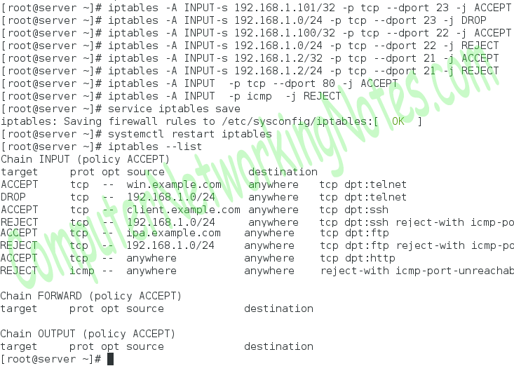

### Testing iptables firewall
We have additional three systems in LAB specially setup for testing purpose. Let’s test our iptables firewall configuration from these systems step by step.

#### Testing from 192.168.1.101/24 (named -win)
We have allowed http and telnet service from this computer while denying the rest.

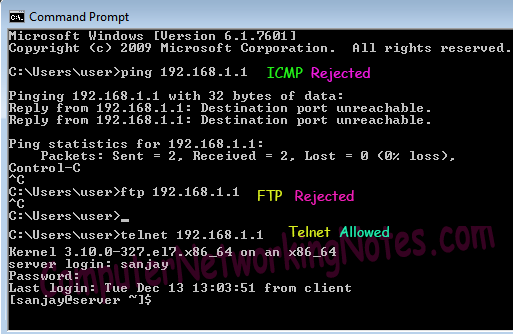

#### Testing from 192.168.1.100/24 (named client)
For this system we allowed http and ssh service while denying the rest. Let’s test them one by one

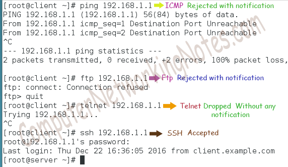

#### Testing from 192168.1.2/24 (named - ipa)
For this system we allowed http and ftp service while denying the rest.

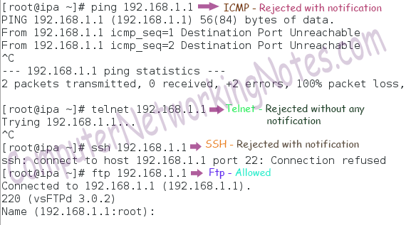

We have successfully finished the practice. Remember in starting of this practice we took the backup of original configuration file. If you are not getting the excepted result, restore the original configuration file back and practice again.

### How to restore original iptables configuration file
To restore the original configuration back use following command
```
cp /etc/sysconfig/iptables.bak /etc/sysconfig/iptables
```
iptables command is a low level tool. iptables command is capable to manages only IPv4 firewall rules. For IPv6 we have to use ip6tables. Another management tool to communicate with netfilter module is firewalld. Firewalld is added in RHEL from version 7. If you have Centos/RHEL 7.0 (or higher), always use firewalld. I will explain firewalld in next part of this article.