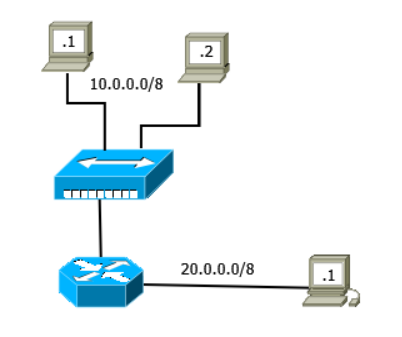
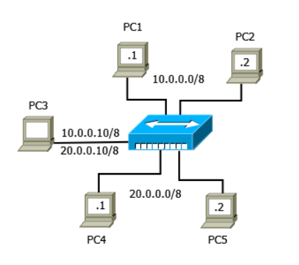
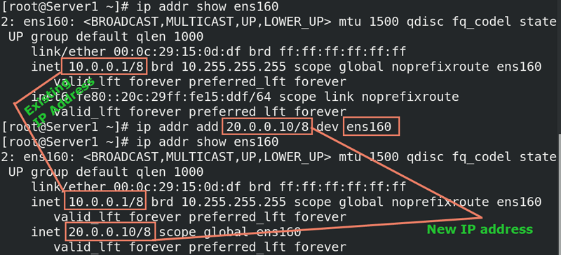
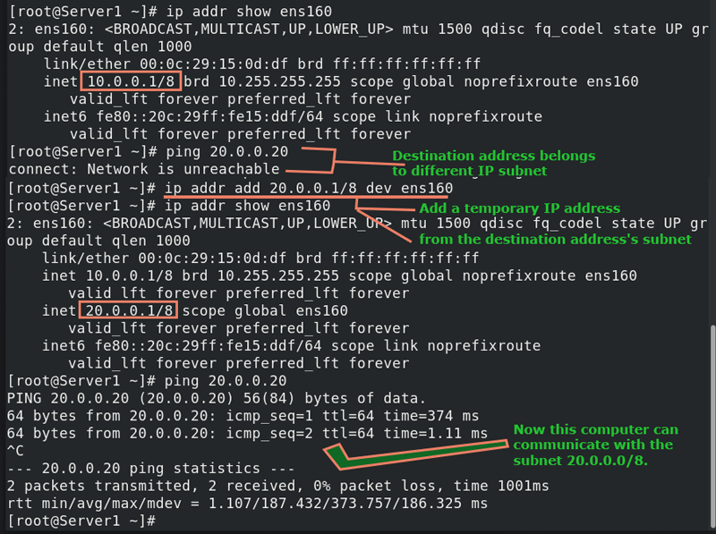
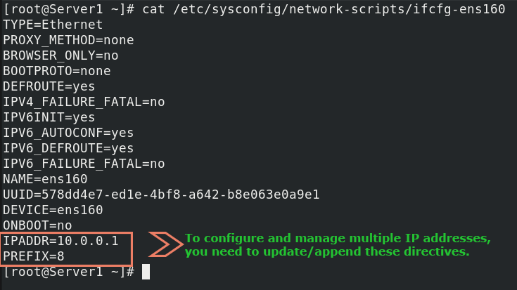
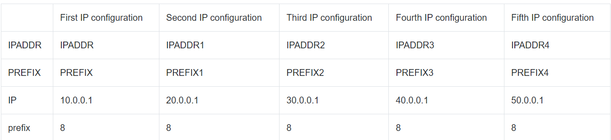
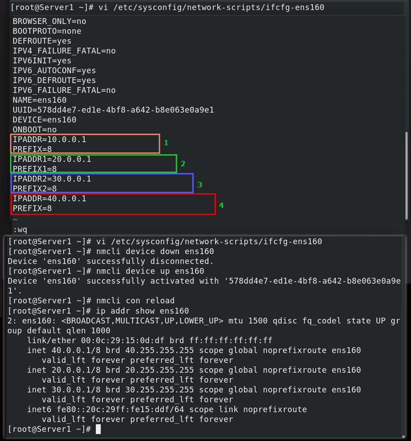
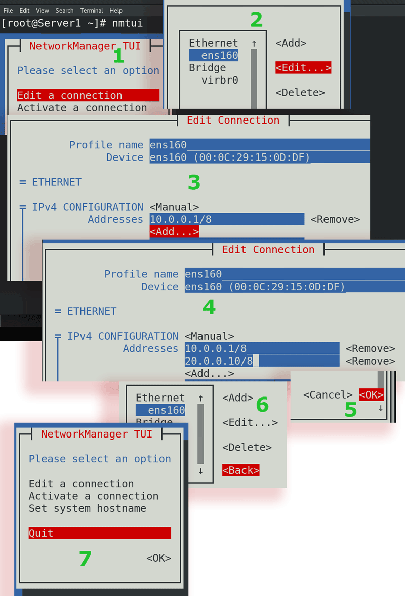
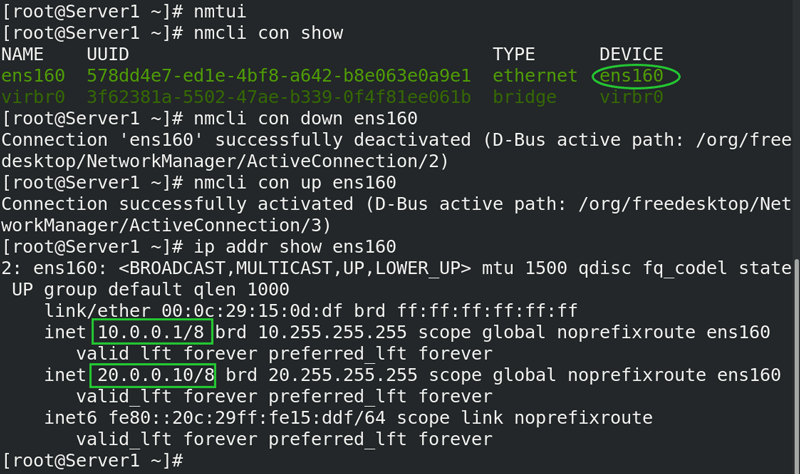

# How to configure multiple IP addresses on Linux

On an IP network, two devices can communicate only if they belong to the same IP subnet. If they belong to different IP subnets, they need a router to communicate.

For example, PC1 and PC2 belong to subnet 10.0.0.0/8, and PC3 belongs to subnet 20.0.0.0/8. In this situation, PC1 and PC2 can communicate directly but they can't communicate with PC3. If they want to communicate with PC3, they need a router



Routers are expensive. Moreover, managing them is also complicated. You should add them to the network only when you have a complex network or your network needs them. If you have a simple network having only some IP subnets, you can assign multiple IP addresses on computers that belong to different IP subnets.

Let's take an example.

The following image shows a simple network. This network has two IP subnets 10.0.0.0/8 and 20.0.0.0/8. PC1 and PC2 belong to subnet 10.0.0.0/8. PC4 and PC5 belong to subnet 20.0.0.0/8. PC3 belongs to both subnets. In this case, you can assign two IP addresses on PC3, one from each subnet.



### Types of IP addresses on Linux

On Linux, you can assign IP addresses in two ways: temporary and permanent. Temporary IP addresses work only in the current login session. Linux stores them in RAM and removes them when you log out from the current login session or restart the system. Permanent IP addresses work until you manually remove them. Linux stores them in configuration files.

    To learn more about how IP addresses work, you can check the following tutorial.

    Linux ip address Command Usages and Examples

### Assigning multiple temporary IP addresses on Linux

To assign multiple temporary IP addresses, we use the following command.
```
#ip addr add [IP ADDRESS/Subnet Mask] dev [interface]
```
The following command adds the IP address 20.0.0.10/8 to the interface ens160.

```
 #ip addr add 20.0.0.10/8 dev ens160
```

The following image shows the above command with the output.



Temporary IP addresses add flexibility to the network. You can use them as per the requirement without making any changes in the configuration files. For example, suppose you want to connect to a different IP network to share or receive some files. In that case, you can configure a temporary IP address from that IP subnet on your computer.

When you assign a temporary IP address from that IP subnet, your computer becomes a member of that IP subnet. If two computers belong to the same IP subnet, they can exchange data without using a router. Temporary IP addresses allow you to exchange data with any connected IP subnet without a router.



### Assigning multiple permanent IP addresses on Linux

If you connect your computer with some different IP subnets regularly, you can configure multiple IP addresses permanently. Linux stores IP configuration and other network settings of an interface in a configuration file. For the naming convention, it uses the interface name with the ifcfg prefix. For example, if the interface name is ens160, then the file name will be ifcfg-ens160. Linux stores all configuration files in the /etc/sysconfig/network-scripts/ directory.



It uses IPADDR and PREFIX directives to save IP addresses.

By adding ascending numbers with these directives, we can configure multiple IP addresses. The following table lists four example IP configurations.



You can use any text editor to update this file. After updating this file, you need to restart the interface.

Use the following commands to restart the interface and its connections.
```
#nmcli device down [interface]
#nmcli device up [interface]
#nmcli con reload
```
The following image shows the above exercise.



If you don't want to edit configuration files directly, you can use the nmtui utility. The Linux ip address Command Usages and Examples utility allows you to add, remove, update, and manage multiple IP addresses.

Use the following steps to configure and manage multiple IP addresses.

* Use the nmtui command to start the utility
* Select the 'Edit a connection' option and press the Enter key
* Select the interface from the left pane and the 'Edit' option from the right pane and press the Enter key
* On the IPv4 configuration option, select the Manual method, select the Add option and press the Enter key
* Set the new IP address
* To remove an IP address, use the Remove option
* You can also update/change an existing IP address
* After making changes, select OK and press the Enter key
* On the previous screen, select the Back option and press the Enter key
* On the main screen, use the Quit option to quit the utility
* The following image shows the above steps.



You need to restart the interface and its connections to apply the changes.




