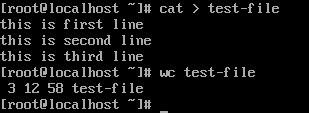

# Linux System Administration Commands Explained with Examples
 
 This tutorial explains basic Linux system administration commands in detail. Learn essential Linux commands for system administration through practical examples.

### Listing the currently logged-in users
When a user logged-in, Linux stores his information in the /var/run/utmp file. This information includes his username, terminal number and login time. This information is stored in raw text format. To read this file, we can use the following command.
```
#cat /var/run/utmp
```
Since information is stored in raw text format and by default, when displaying text, the cat command does not change the format of text, the output of this command may look messy. To view the properly formatted output, you can use the following two commands.
```
#who
#who am i
```
Both commands work in similar fashion. Both commands read raw text from the /var/run/utmp file and properly format that before displaying on the command prompt. The only difference between both commands is that the who command displays information about all users while the who am i command displays information only about the user who executes it.

Following image shows an example of all three commands.


### Knowing the last successful login, failed login attempts and system reboot time
Just like keeping track of active users, Linux also keeps the record of previous successful login sessions, failed login attempts and last system reboots. It stores information about previous successful login sessions in the file /var/log/wtmp. To store information about the failed login attempts, it uses the file /var/log/btmp.

You can read these files directly or can use the following commands.
```
#last
#last reboot
#lastb
```
The **last** command prints the list of users who had successfully accessed the system. This command does not tell you what user did after login. It only tells you that which user logged-in at what time on which terminal and how many time he stayed login.

The **last reboot** command prints the last reboot time of the system. Through this command, you can know when the system was restarted or rebooted last time.

The **lastb** command prints the list of failed login attempts. Through this command, you can know which user account was used with the wrong password to login on which terminal and what time.

Following image shows example of above commands.


### Getting detailed information about active users

If you need more detailed information about active users including what they are doing, you can use the w command. The w command provides two types of information; System specific and User specific.

**System specific information**

* Current time of day
* System uptime
* Total number of active users (currently logged in)
* Average load (number of jobs in run queue)
* User specific information

**User login name**
* Terminal number from which user is logged in
* Host name (Name of system where user is logged in)
* Login session time (the time the user stayed logged-in)
* Last activity time (the time since the user last typed anything)
* JCPU time (the time taken by all process excluding past background jobs.)
* PCPU time (the time taken by current process)
* Current process

Following image shows a practical example of the w command.


### Knowing the system uptime
To know how long the system has been up, you can use the uptime command. Besides system’s uptime, it also provides the following information:-

Current system time, number of currently logged-in users, system load average for past 1, 5 and 15 minutes respectively.

As explained above, same information can also be obtained from the w command. The difference between both commands is that the w command provides this information along with the information of active users.

If you want to obtain both types of information, use the w command. If you want to get system specific information only, use the uptime command.

Following image shows both commands with output.


### Viewing login name/username

To view the login name, you can use either the logname command or the whoami command. Both commands display the username. The difference between both commands is that the logname command displays the username of that user account which was used to login while the whoami command displays the username of the current user account.

Let’s take a simple example to understand the difference between both commands. Login from a user account and use both commands to print the username. Both commands will display the same result.

Now, change user account through the su command and run both commands again. This time the whoami command will display the username of new user account while the logname command will still display the old login name.

Now logout from the new account and run both commands again. This time both commands will display the same result again.

Following image shows this exercise.


### Knowing hostname, kernel version number, processor type and hardware architecture

You can use the uname command to view the basic system information such as hostname, operating system name, hardware platform and kernel information (name, version, built etc.) Without any option, this command only displays the operating system name. To view other information, you have to use the related option. Following table lists some common options with description.


Following image shows two examples of the uname command.


### Viewing and setting the hostname

You can view the hostname of system through two commands; the hostname and hostnamectl. To view the hostname only, use the hostname command. To view the detailed information about hostname along with the hardware information, use the hostnamectl command.

The hostnamectl command also allows us to set the hostname. To change the hostname, use the set-hostname option with this command.

Following image shows how to use both commands practically.


### Viewing and setting the date and time

To view or set the date and time, we have two commands; date and timedatectl. Without any option, both commands display the current date and time. The date command provides basic information while the timedatectl provides detailed information.

To change the date and time from the date command, use the date command as explained below.
```
# date --set "YYYY-MM-DD HH:MM:SS"
```
To change the date and time from the timedatectl command, use the timedatectl command as explained below.
```
# timedatectl set-time YYYY-MM-DD
# timedatectl set-time HH:MM:SS
```
Following image shows both commands with examples.


### Finding the command location
Every command in Linux has an associated script file. When we type a command at command prompt and hit the Enter key, Shell finds the related script file and executes it. To know the location of any command’s associated script file, you can use the which command.

Following image shows an example of the which command.


#### Counting the lines, words and characters
To count the lines, words and characters of a file, you can use the wc command. The wc command counts and displays the number of lines, words and characters of the supplied file.



### Viewing all running processes in the system

The ps –ef command lists all running processes in the system. To figure out whether a particular process is running or not, you can filter the output of this command through the grep command. For example to figure out whether the Firefox is running or not, you can use the following command.
```
#ps -ef |grep firefox
```
Terminating a halted process
Linux assigns a unique process ID to each running process. You can use this process ID to terminate a halted process. To know the process ID of halted process, use the following command.
```
#ps -ef |grep [name of halted process]
```
Once you know the process ID of halted process, use it with the kill command to terminate that process.

Following image illustrates the finding and killing process of the Firefox web browser process.


Viewing the real time usage of hardware resources
To view the real time hardware usage, you can use the top command. The top command displays the real time usage of hardware resources such as CPU and memory.

Following image displays the use of the top command.


***To terminate the command, press the q key.***

### Getting detailed hardware information

To get the detailed hardware information, you can use the lspci, lsscsi, lsusb and lscpu commands.

**lspci** :- This command provides information about the pci buses and their attached devices.

**lsscsi** :- This command provides information about the scsi devices.

**lsusb** :- This command displays information about the USB ports and attached devices.

**lscpu** :- This command displays information about the CPU.

Following image shows all above commands with output.

