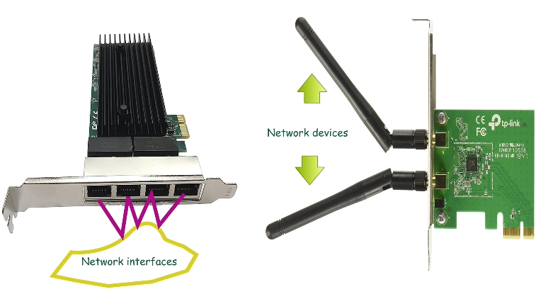
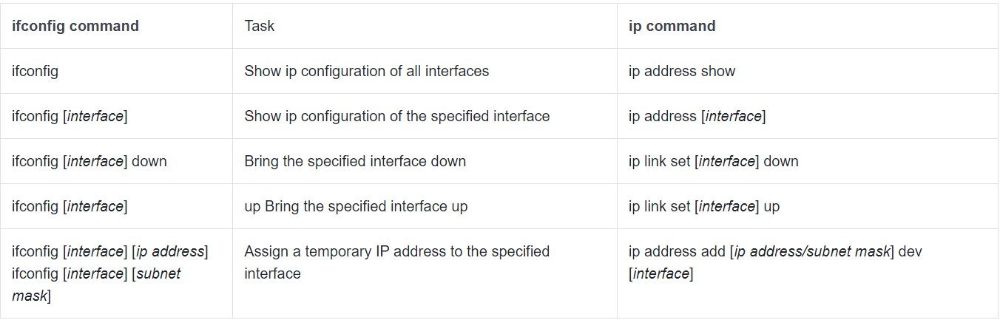

# Linux ip address Command Usages and Examples

This tutorial explains how to use the Linux ip address command to validate and verify IP configuration on Linux. Learn the default naming scheme Linux uses for network interfaces.

You can use the **ip command** to manage and monitor many aspects of networking. For the RHCSA/RHCE exam, you need to know how to use this command to perform the following tasks.

* To view the IP configuration of an interface or all interfaces
* To check routing information
* To check the link state of all interfaces or a specific interface
* To assign the temporary IP configuration to an interface
* To temporary change the link state of an interface
Before we learn how to use the ip command to perform these tasks, let’s briefly understand the terminology and naming scheme Linux uses for network interfaces.

### Network interfaces and connections
LAN cards, network adapters, or network interface cards are hardware adapters that provide one or more Ethernet ports. An Ethernet port is called a network device or a network interface.



A network interface uses a connection to connect the network. A connection is a collection of all settings the interface needs to connect to the network. IP configuration, hardware address, boot state, and device name are some examples of the settings the connection includes.


You can assign multiple connections to an interface but can use only one connection at a time. To assign multiple connections, you need to use a unique name for each connection. You can also configure the interface to automatically select the appropriate connection.

### Default naming scheme for interface names
Starting from RHEL 7, the udevd service provides the default naming scheme for network interfaces. This service usages many rulesets to assign a unique name to each interface. To generate a unique name for an interface, it uses the device’ firmware, topology, and type.

In generated name, the first two letters represent the device's firmware. For example, Ethernet interfaces begin with en, WLAN interfaces begin with wl, and WWAN interfaces begin with ww.


The next letter represents the device’s type, location, or topology. For example, the letter o represents an onboard device, the letter s represents a hot plug slot, and the letter p represents a PCI card.


The remaining numbers represent an index, ID, or port.

Let's take an example name eno16777737. In this name, the first two letters en stand for an Ethernet interface. The next letter o stands for an onboard interface. The remaining number 16777737 is a unique ID number.

### Viewing configurations

To view configurations of all interfaces or a specific interface, use the following commands.
```
ip addr show
ip addr show [interface]
```
This first command displays the current configuration of all interfaces. The second command displays the current configuration of the specified interface. For example, the following command displays the configuration of the ens160 interface.
```
ip addr show ens160
```
The following image shows the output of the above commands.


The first line shows the link state of the interface. The UP state shows the interface is up and operational. The Down state shows the interface is down. When troubleshooting a connectivity-related issue, checking the link state of the interface should be your first step. An interface can connect to the network only if the link state of the interface is UP.

The second line shows the MAC address of the interface. The next lines show the IPv4 and IPv6 configurations.

### Viewing routing information
To view the IP address of the default gateway router, you can use the following command.
```
ip route show
```
This command displays the default gateway IP address. Default gateway connects the host to the remote network.

The following image shows the output of this command.


### Viewing the link state information

To view only the link state information of all interfaces, use the following command.
```
ip link state
```

To view link state information of a particular interface, specify its name. For example, the following command shows the link state information of the interface ens160.
```
ip link state ens160
```
The following image shows the output of the above commands.


### Changing the link state information
The following command sets the link state of an interface to up.
```
ip link set dev [interface name] up
```
The following command sets the link state of an interface to down.
```
ip link set dev [interface name] down
```
The following image shows how to use the above commands to change the link state of the ens160 interface.


### Adding a temporary IP address

To set a temporary IP address on the interface, use the following command.
```
ip addr add [ip_address/subnet_mask] dev [interface_name]
```
The above command sets the new IP address in addition to the current IP address. It does not remove or replace the current IP address. The following command sets the IP address 10.0.0.1/8 to the ens160 interface.
```
ip addr 10.0.0.1/8 dev ens160
```
The following image shows the output of the above command.


### Key points
The **ip command** makes changes only in the running configuration. It does not save the changes. When you reboot the system or log out from the current session, all changes made by the ip command will be lost.

The **ip command** supports command line abbreviation. You don’t need to type the complete option. You can abbreviate the ip addr show command as ip a s.

### The **ip command** cheat sheet
Following tables list how to use the **ip command** to perform some common tasks.

#### Viewing/managing IP addresses


Viewing/managing multicast addresses


Displaying/managing link state information


### Showing default gateway/route


### Displaying ARP/neighbor table


### Viewing help


## The ip command v/s the ifconfig command

he ip command is a replacement for the ifconfig command. In earlier versions of Linux, the ifconfig command was the default utility for checking and verifying IP configuration. The ifconfig command does not support many modern features that were not relevant in earlier times.

The ifconfig command is deprecated. Although some Linux distributions still include the ifconfig command for backward compatibility in their current version of Linux, they may consider gradually removing it from their upcoming Linux versions.

Because of this, even if the ifconfig command is still available on some Linux distributions, you should use the ip command for all IP validation and verification-related tasks. The ip command is designed to meet the requirements of modern networks.

The following tables lists how to perform some common tasks using both commands.



