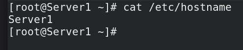

# Network Configuration Files in Linux Explained

Linux uses a separate network configuration file for each network interface to store its IP addresses and other network-related settings. It stores all network configuration files in the /**etc/sysconfig/network-scripts** directory.

For the naming convention, it uses the ifcfg- prefix and interface name. For example, if the interface name is eno16777736, then the name of its configuration file will ifcfg-eno16777736.


The following table briefly describes the files stored in the /etc/sysconfig/network-scripts/ directory.


Since RHEL8, Linux does not use script files to manage network-related settings. To manage all network-related settings, it uses NetworkManager. Because of this, on RHEL8 and later versions, you will not see ifup-* and ifdown-* script files. You will see only ifcfg-* files. Linux uses these files to store network configurations of interfaces.


Settings stored in the interface’s configuration file are applied to the interface when we start the system or activate the interface. To view these settings, you can use the cat command. For example, the following command displays the settings of the eno16777736 interface.
```
#cat /etc/sysconfig/network-scripts/ifcfg-eno16777736
```


### Configuration directives
The following table lists important directives and their descriptions.


In addition to the above-listed directives, there are many other directives that you can use in the network configuration file. To view a complete list of all directives and their meanings, you can use the following command.

```
#man nm-settings
```
This command lists all directives and their meanings.


You can edit network configuration files directly or can use NetworkManager's tools. NetworkManager provides three tools to edit network configuration files. These tools are nmcli, nmtui, and nm-connection-editor.

        To learn more about these tools, you can check the following tutorials.

        Understanding Linux Network Manager Fundamental

        The nmcli command on Linux Examples and Usages

        The nmtui Command and Utility on Linux

        The nm-connection-editor command on Linux

You can use the **nmcli con show** command to view the configured value of all settings. For example, the following command displays all configured values of the ens160 interface.
```
#nmcli con show ens160
```
This command lists all settings/directives of the connection. If a setting has a configuration value, it displays the configured value. If a setting does not have a configuration value, it displays the default value.


### The /etc/hosts file
This file maps the hostname with the IP address. After mapping a hostname with the IP address, you can use the hostname to access the services available on the destination IP address. There are two ways to map a hostname with the IP address: the DNS Server and the /etc/hosts file.

DNS servers provide a lot of functionalities. They can map millions of hostnames with IP addresses, but they are complex. They need a lot of configurations. Usually, they are not used in small networks.

In a small network, you can use the /etc/hosts files. The /etc/hosts file allows you to map hostnames with IP addresses on the local system. You need to update this file manually.

Each row in this file represents a unique entry. It contains an IP address in the first column, the full or official hostname in the second column, and the short or alias name in the third column.

The following image shows an example of this file.


If you want to use the DNS server, do not update the /etc/hosts file. The system uses the /etc/hosts file in the first place to resolve the IP address. It sends a query to the DNS server only if it does not find an entry for that IP address in the /etc/hosts file.

### The /etc/resolv.conf file

Linux stores DNS server IP addresses in this file. By default, this file is not present. Linux dynamically generates and updates this file when you configure the DNS server's IP address.

When you configure or change the DNS server IP address, Linux store it in the network configuration file available in the /etc/sysconfig/network-scripts/ directory and pushes the configuration to the /etc/resolv.conf file. Since Linux dynamically updates this file, you should not edit this file directly.

If you manually edit this file, the changes will work only until you don't restart NetworkManager. When you restart NetworkManager, it automatically updates this file from the configuration stored in the network configuration file.

To verify it, use the following steps.

* Use the cat command to display the current configuration stored in the /etc/resolv.conf
* Manually update the configuration file and verify the change
* Restart the NetworkManager service
* Use the cat command again to display the configuration

The following image shows the above exercise.


### The /etc/hostname file
There are three types of hostnames static, pretty, and transient. Services running on the local system use the static hostname to refer to the system. If the system is connected to the network, services running on other computers use the transient hostname to refer to the system. Users use the pretty hostname to refer to the system.

Of these names, the static hostname is the most important. Linux always needs it. Since it is the most important, Linux has a default static hostname (localhost.localdomain). Linux uses it when the manual static hostname is not available.

It stores the static hostname in the /etc/hostname file. You can edit this file directly or use the hostnamectl command.



        To learn more about the hostname, you can check the following tutorial.

        How to change the hostname on Linux

        It explains all types of hostnames and how to configure each type in detail.

### The /etc/sysconfig/network file

This file works differently based on the installation of the network service. Before RHEL8, the network service was used to control networking-related settings. In RHEL8, the network service was deprecated. It was replaced by NetworkManager.

#### Before RHEL8 (The network service is installed.)
This file, based on how the network interfaces are configured, may contain none, one, or two configuration directives. If a system is configured to get IP configuration from the DHCP server, there will be no configuration in this file.

Two directives that may appear in this file are; GATEWAY and NETWORKING.

**GATEWAY** directive shows the IP address of the default gateway. This directive appears only if the same IP address is used for the default gateway in all network interfaces.

**NETWORKING** directive is used to control the network service. It can be configured with two values; yes and no. If the value "no" is used, the network service does not start.

To understand how the "NETWORKING=no" directive affects the network service practically, follow these steps on your test system.

* Take the backup of the /etc/sysconfig/network file.
* Delete the NETWORKING directive or set its value to "yes".
* Check the status of the network service.
* Add the "NETWORKING=no" directive in the /etc/sysconfig/network file
* Restart the network service.
* Remove the "NETWORKING=no" directive or restore the original file back
* Check the status of the network service again.

The following image shows the status of the network service when the /etc/sysconfig/network file does not contain the NETWORKING directive.


The next image shows how the "NETWORKING=no" directive affects the network service.


As we can see in the above image, the "NETWORKING=no" directive does not allow the network service to start. To start the network service again, either we have to remove this directive or set its value to "yes". After this, we can start the network service again. The following image shows these steps.


#### On and after RHEL8

If the network service is absent and NetworkManager is installed, this file contains nothing. Since this file works with the network service, updating this file does not affect the NetworkManager service.

To verify it, open this file, set NETWORKING to no, save the file, and restart the NetworkManager service.

The following image shows this exercise.


