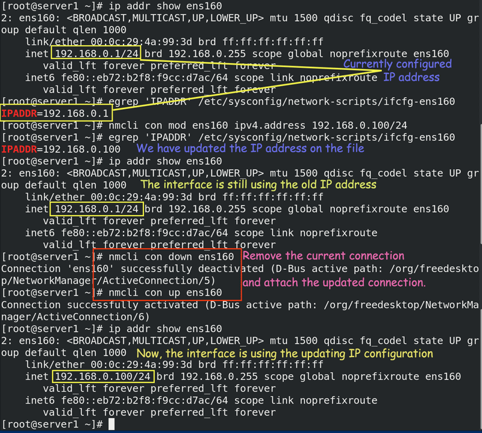

# The nmcli command on Linux Examples and Usages

This tutorial explains how to use the nmcli command on Linux to view, configure, and manage configurations on network devices and connections.

On Linux, a network device is an Ethernet card. A connection is a collection of settings that the Ethernet card needs to connect to the network. A computer can have multiple ethernet cards. An ethernet card can have multiple connections but can use only one connection at a time.

There are many methods to create, configure and manage connections. The nmcli command is one of them. It uses the following syntax.

```
#nmcli [options] [section] [action]
```

### Options

Options are optional. They allow us to control the default behavior of commands. You can use them to modify the output in such a way that it only displays the required information in the desired format.


The nmcli command organizes its parameters in the following eight sections.


### Action

You can use the nmcli command to perform various tasks such as displaying information, creating and managing configuration, changing device and connection status, etc. A task is an action. Based on your requirement, you can specify one or more actions.

### The nmcli command examples

The nmcli command is part of the NetworkManager package. NetworkManager provides the default network service on Linux. To know whether the NetworkManager service is running or not, you can use the following command.

```
# nmcli -t -f RUNNING general
```


To list all available network devices and their current status, you can use the following command.

```
# nmcli dev status
```


As I mentioned earlier, a device can have multiple connections. To view all available connections, you can use the following command.

```
#nmcli con show
```


To view all configured values of a connection, you need to specify its name as the argument.

The following command lists all configured values of the ens160 connection.

```
#nmcli con show ens160
```


You can also add a new connection. To add a new connection, use the add option. The following command adds a new connection named custeth1. This connection will receive an IP address from the DHCP server.

```
#nmcli con add con-name custeth1 type ethernet ifname custeth1 ipv4.method auto
```


When we add a new connection, the nmcli command creates a new file in the /etc/sysconfig/network-scripts/ directory and stores all configuration values in it. It uses the connection name as the file name with the ifcfg- suffix.


There are multiple ways to edit a connection configuration file. You can directly edit it by using a text editor or can use a network management tool. You can also use the nmcli command to edit this file.

To update this file by using the nmcli command, use the modify option. For example, the following command updates the custeth1 connection. It changes the IP configuration type to manual from DHCP and assigns an IP configuration (IP address 10.0.0.10/8 and default gateway 10.0.0.1)

```
#nmcli con modify custeth1 ipv4.method manual ipv4.address 10.0.0.10/8 ipv4.gateway 10.10.10.1
```


ou can also view and change the value of a single directive. Use the egrep command to print the value of single or multiple directives, and use the modify option with the nmcli con command to change its value.

The following commands print, change, and reprint the value of the ONBOOT directive.

The ONBOOT directive controls the boot time behavior of the connection. The boot process starts this connection at the boot time only if you set its value to yes.


The nmcli command also offers an interactive editor to edit a connection. To edit a connection named custeth1 using the interactive editor, use the following command.

```
#nmcli con edit custeth1
```

You can use the help option to list all available options and their usage.


The following image shows how to update the default gateway IP address using the interactive editor.


An interface reads the connection file, only when it starts. It does not monitor the changes to the connection file. If you make any change to a connection file, you need to update the interface about the change manually. To force an interface to use the updated connection file, you need to remove the current connection from the interface. After removing the current connection, you need to attach the updated connection again.

To remove an active connection, use the following command.

```
#nmcli con down [connection name]
```
To attach a new or updated connection, use the following command.

```
#nmcli con up [connection name]

```

The following image shows how to remove an existing connection and add a new connection.



To force the Network Manager service to reread all connection files, use the following command.

```
#nmcli con reload
```


A connection is just a collection of settings. It has no use unless you apply it to an interface. To apply it to an interface, use the following command.

```
#nmcli con up [connection name]

```

When activating a connection, you may get the following error.

Error: Connection activation failed: No suitable device was found for this connection. (Device ens160 is not available because the profile is not compatible with the device (mismatching interface name)).

This error indicates that you are activating a connection that was created for an interface that is not available on the system. You can fix this error by changing the interface name in the connection's setting.

When you activate a new connection, the existing connection becomes inactive.

The following image shows how to activate and deactivate a connection and how to fix the interface name error.


If you want to delete a connection, use the delete option. The following command deletes the connection custeth1.

```
#nmcli con del custeth1
```


## Summary

The following table lists some common usages of the nmcli command.

