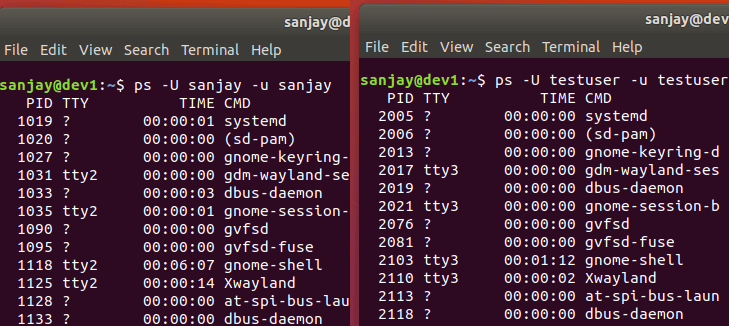

# ps aux command and ps command explained

This tutorial explains how to use the ps command in Linux. It also provides 10+ practical examples of the ps command. Learn how to read the output of ps aux command in detail.

### A brief intro of the ps command
The ps (process status) command is one of the most frequently used commands in Linux. Usually it is used to get the more and detailed information about a specific process or all processes. For example it is used to know whether a particular process is running or not, who is running what process in system, which process is using higher memory or CPU, how long a process is running, etc.

### LAB Setup
For practice, start some applications and keep them running. Switch the user account and repeat the same process.


Now suppose, you are a system administrator and being a system administrator you want to know what's going on in system. In this case, you can use the ps command to get the required information.

### Using the ps command
Open terminal and run the ps command


Without any option and argument, the ps command shows only the process running under the logged in user account from the current terminal.

You may wonder why the ps command is showing two processes while we haven't executed any process from this terminal so far.

Well… first process shows the process under which this terminal is opened. This process remains open, till the terminal is opened.

Second process shows the last executed command in this terminal.

### Specifying options with the ps command
The **ps** command accepts options in three styles.

**BSD UNIX style**: - In this style, options are supplied without any leading dash (such as "aux").

**AT & T Unix style**: - In this style, options are supplied with a leading dash (such as "-aux").

**GNU Linux style**: - In this style, options are supplied with double leading dashes (such as "--sort").

Although the PS command accepts options in the mix style, you should always use only one style to specify the options.

### Basic examples of the ps command

To print all running processes in system, use any one of the following commands.
```
$ps –A
$ps -e
```


The options A and e provide summarized overview of running processes. To print the detailed overview, use the options f (full format) and F (extra full format) with these options.


To view the same output in BSD Unix style, use the options "aux".


The **"ps aux"** command is the most frequently used command by Linux administrators. Before we move to the next example, let's understand the options used in this command in detail.

### ps aux command options
a:- This option prints the running processes from all users.

u:- This option shows user or owner column in output.

x:- This option prints the processes those have not been executed from the terminal.

Collectively the options "aux" print all the running process in system regardless from where they have been executed.

The ps aux command output description column by column


ps aux stat code with description


Key points 

* CPU usage is expressed as the percentage of time spent running during the entire lifetime of a process.
* The SIZE and RSS fields don't count some parts of a process including the page tables, kernel stack, struct thread_info, and struct task_struct.
* SIZE is the virtual size of the process (code+data+stack).
* Processes marked <defunct> are dead processes (so-called "zombies") that remain because their parent has not destroyed them properly.
* If the length of the username is greater than the length of the display column, the username will be truncated.

### 10+ practical examples of the ps command

To display all process running under the root user account, use the following command.
```
$ps -U root -u root
```
In this command:-

**-U:** - Select the process based on real user ID or name.

**-u:** - Select the process based on effective user ID or name.

RUID (Real User ID) represents the name of user while EUID (Effective User ID) describes the user whose file access permissions are used by the process.


To display all process running by a specific user account, use the following command.

```
$ps –U [UserName] –u [UserName]
```



To display all process running under a particular group, use the following command.
```
$ps –G [Group Name]
```
For a detailed overview, we can also combine –G option with –F option.
```
$ps –FG [Group Name]
```


To display all process in hierarchy, we can use the following command.
```
$ps –A --forest
```


### Displaying only specific column

By default ps command displays all columns. If we are interested only in particular columns, we can limit the output by specifying the required column names as arguments.

For example, to view only PID, USER and CMD columns, we can use the following command.

```
$ps –eo pid,user,cmd
```


### Finding the process which is using the highest memory

By default, ps command does not sort the output. By setting sort order to %MEM, we can find the processes which are consuming higher memories.

To set the sort order, --sort=[column name] option is used. We can also combine this option with other options to get the more specific output.

For example, let's display only the specific fields and order them by memory usages.
```
$ps –eo pid,user,%mem,cmd --sort=-%mem
```


### Limiting output

By default, the ps command does not limit the result in output. If we are interested only in knowing the top three processes which are consuming the highest memory, instead of displaying the ps command's output in terminal we can redirect it to the head command.

By default, the head command displays top 10 lines from the provided source. We can override this default behavior by specifying the required line numbers.

To display only top three processes, we can use "-n 4" option with the head command.


For 3 results, supply the digit 4 as argument. As in ps command's output, the first line is occupied by the titles.

#### Finding the process which is using the highest CPU

Just like we figured out the highest memory consuming processes, we can also find the highest CPU consuming processes by sorting the output based on CPU column. For example following command prints top 3 processes ordered by CPU usage.

```
$ps –eo pid,user,%cpu,cmd –-sort=-%cpu | head –n 4
```


#### Finding the total number of processes running by a user

To figure out the total number of process running by a user, use the following command
```
$ps –U [UserName] –u [UserName] | wc –l
```
In this command, instead of printing the output of the ps command in terminal, we redirected it to wc command. The wc -l command counts the number of lines form the given source.